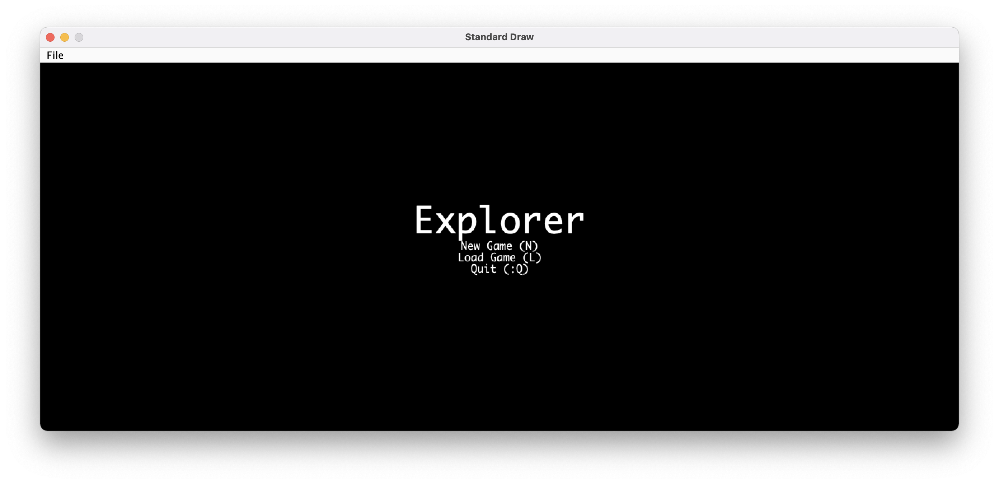
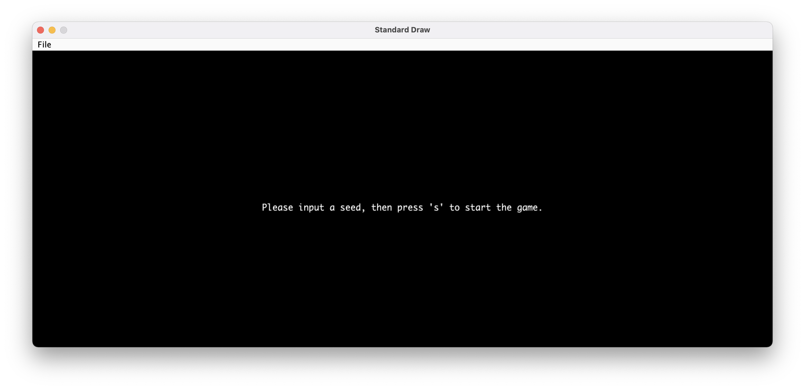
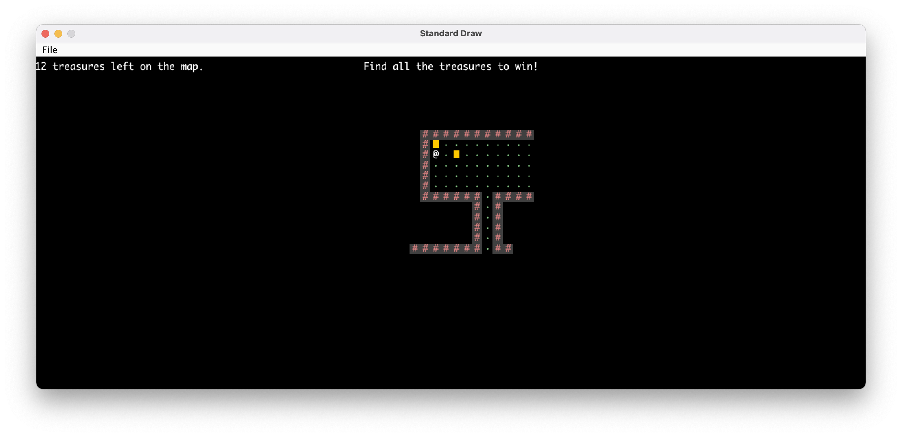
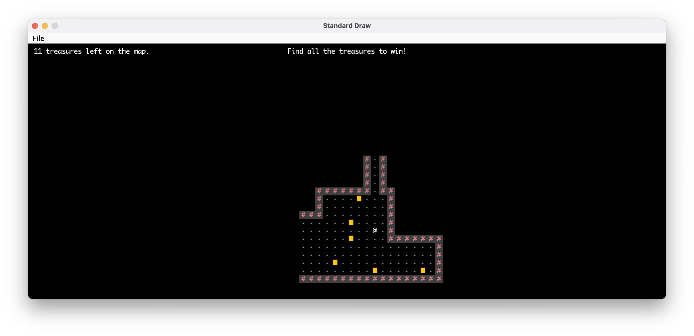

# Explorer-2D-Game
- [About](#about)
- [Demo](#demo)
- [Usage Guide](#usage-guide)
- [Program Structure](#program-structure)

# About
A 2D game implemented with Java. Start with a randomly generated map, and the goal is to find all the treasures within the map. Main charactor has limited vision.

# Demo
Starting
 
Randomly generate a map with a given seed
 
Move the Avatar using A(left), D(right), W(up), S(down)
 
Save and quit at given state
 
After loading, returns to the same state.
 

# Usage Guide
1. Clone and `cd` into repository via: 

   `git clone https://github.com/Sheldenshi/Explorer-2D-Game.git && cd Explorer-2D-Game`
   
2. Run Explorer-2D-Game.jar

# Program Structure
